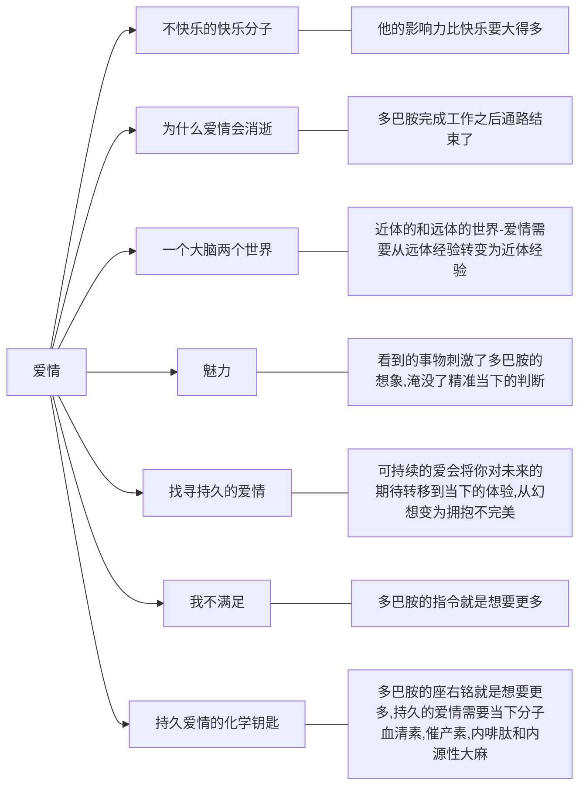

```mermaid
graph LR;
  A1[爱情]-->A11[不快乐的快乐分子]---他的影响力比快乐要大得多
  A1-->A12[为什么爱情会消逝]---多巴胺完成工作之后通路结束了
  A1-->A13[一个大脑两个世界]---近体的和远体的世界-爱情需要从远体经验转变为近体经验
  A1-->A14[魅力]---看到的事物刺激了多巴胺的想象,淹没了精准当下的判断
  A1-->A15[找寻持久的爱情]---可持续的爱会将你对未来的期待转移到当下的体验,从幻想变为拥抱不完美
  A1-->A16[我不满足]---多巴胺的指令就是想要更多
  A1-->A17[持久爱情的化学钥匙]---多巴胺的座右铭就是想要更多,持久的爱情需要当下分子血清素,催产素,内啡肽和内源性大麻
```