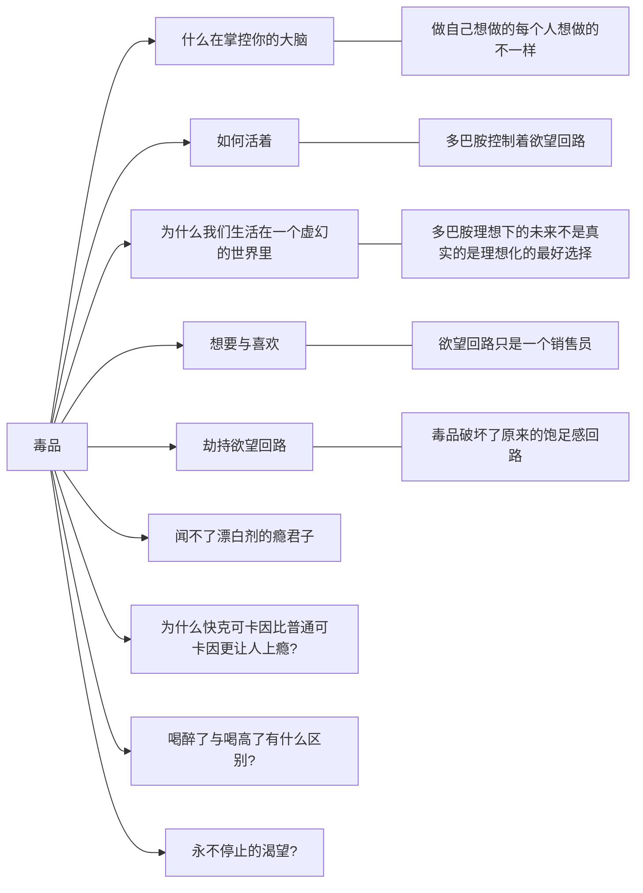

```mermaid
graph LR;
  A2[毒品]-->A21[什么在掌控你的大脑]---做自己想做的每个人想做的不一样
  A2-->A22[如何活着]---多巴胺控制着欲望回路
  A2-->A23[为什么我们生活在一个虚幻的世界里]---多巴胺理想下的未来不是真实的是理想化的最好选择
  A2-->A24[想要与喜欢]---欲望回路只是一个销售员
  A2-->A25[劫持欲望回路]---毒品破坏了原来的饱足感回路
  A2-->A26[闻不了漂白剂的瘾君子]
  A2-->A27[为什么快克可卡因比普通可卡因更让人上瘾?]
  A2-->A28[喝醉了与喝高了有什么区别?]
  A2-->A29[永不停止的渴望?]
```