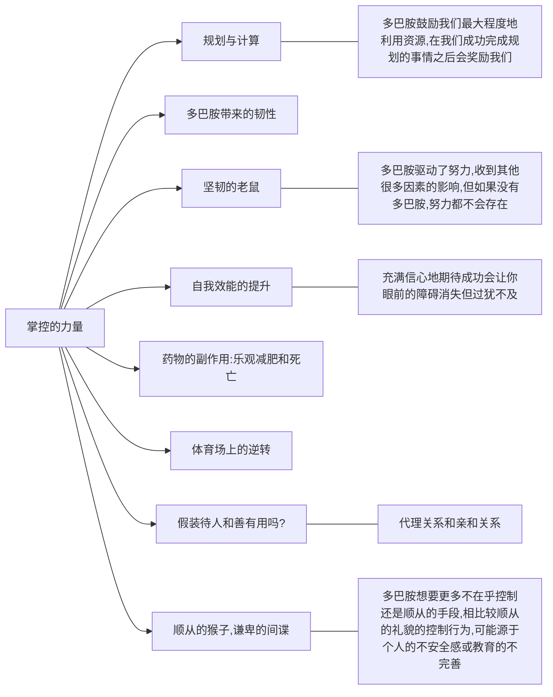

```mermaid
graph LR;
  A3[掌控的力量]-->A31[规划与计算]---多巴胺鼓励我们最大程度地利用资源,在我们成功完成规划的事情之后会奖励我们
  A3-->A32[多巴胺带来的韧性]
  A3-->A33[坚韧的老鼠]---多巴胺驱动了努力,收到其他很多因素的影响,但如果没有多巴胺,努力都不会存在
  A3-->A34[自我效能的提升]---充满信心地期待成功会让你眼前的障碍消失但过犹不及
  A3-->A35[药物的副作用:乐观减肥和死亡]
  A3-->A36[体育场上的逆转]
  A3-->A37[假装待人和善有用吗?]---代理关系和亲和关系
  A3-->A38[顺从的猴子,谦卑的间谍]---多巴胺想要更多不在乎控制还是顺从的手段,相比较顺从的礼貌的控制行为,可能源于个人的不安全感或教育的不完善
```