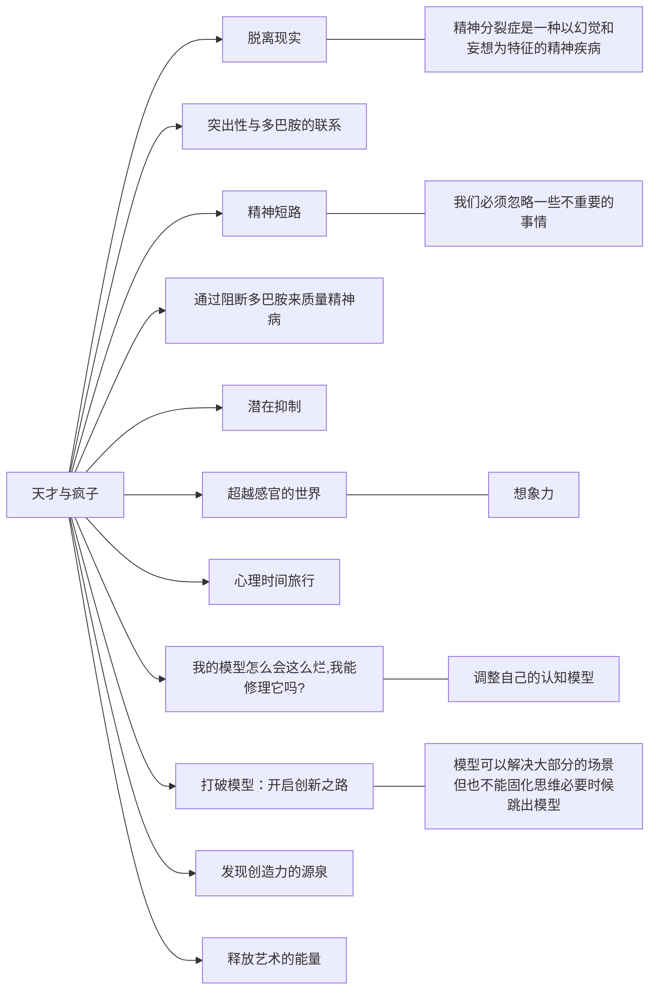

```mermaid
graph LR;
  A4[天才与疯子]-->A41[脱离现实]---精神分裂症是一种以幻觉和妄想为特征的精神疾病
  A4-->A42[突出性与多巴胺的联系]
  A4-->A43[精神短路]---我们必须忽略一些不重要的事情
  A4-->A44[通过阻断多巴胺来质量精神病]
  A4-->A45[潜在抑制]
  A4-->A46[超越感官的世界]---想象力
  A4-->A47[心理时间旅行]
  A4-->A48["我的模型怎么会这么烂,我能修理它吗?"]---调整自己的认知模型
  A4-->A49["打破模型：开启创新之路"]---模型可以解决大部分的场景但也不能固化思维必要时候跳出模型
  A4-->A410[发现创造力的源泉]
  A4-->A411[释放艺术的能量]
```