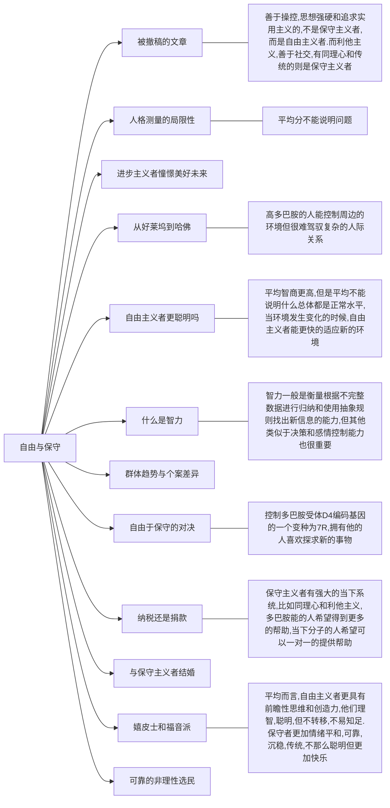

```mermaid
graph LR;
  A5[自由与保守]-->A51[被撤稿的文章]---善于操控,思想强硬和追求实用主义的,不是保守主义者,而是自由主义者.而利他主义,善于社交,有同理心和传统的则是保守主义者
  A5-->A52[人格测量的局限性]---平均分不能说明问题
  A5-->A53[进步主义者憧憬美好未来]
  A5-->A54[从好莱坞到哈佛]---高多巴胺的人能控制周边的环境但很难驾驭复杂的人际关系
  A5-->A55[自由主义者更聪明吗]---平均智商更高,但是平均不能说明什么总体都是正常水平,当环境发生变化的时候,自由主义者能更快的适应新的环境
  A5-->A56[什么是智力]---智力一般是衡量根据不完整数据进行归纳和使用抽象规则找出新信息的能力,但其他类似于决策和感情控制能力也很重要
  A5-->A57[群体趋势与个案差异]
  A5-->A58[自由于保守的对决]---控制多巴胺受体D4编码基因的一个变种为7R,拥有他的人喜欢探求新的事物
  A5-->A59[纳税还是捐款]---保守主义者有强大的当下系统,比如同理心和利他主义,多巴胺能的人希望得到更多的帮助,当下分子的人希望可以一对一的提供帮助
  A5-->A510[与保守主义者结婚]
  A5-->A511[嬉皮士和福音派]---平均而言,自由主义者更具有前瞻性思维和创造力,他们理智,聪明,但不转移,不易知足.保守者更加情绪平和,可靠,沉稳,传统,不那么聪明但更加快乐
  A5-->A512[可靠的非理性选民]
```