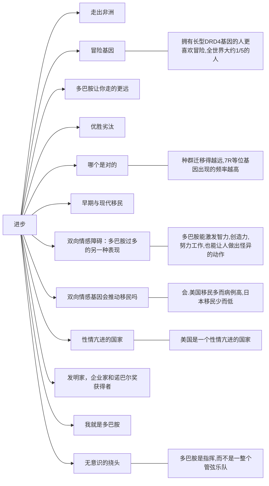

```mermaid
graph LR;
  A6[进步]-->A61[走出非洲]
  A6-->A62[冒险基因]---拥有长型DRD4基因的人更喜欢冒险,全世界大约1/5的人
  A6-->A63[多巴胺让你走的更远]
  A6-->A64[优胜劣汰]
  A6-->A65[哪个是对的]---种群迁移得越远,7R等位基因出现的频率越高
  A6-->A66[早期与现代移民]
  A6-->A67["双向情感障碍：多巴胺过多的另一种表现"]---多巴胺能激发智力,创造力,努力工作,也能让人做出怪异的动作
  A6-->A68[双向情感基因会推动移民吗]---会.美国移民多而病例高,日本移民少而低
  A6-->A69[性情亢进的国家]---美国是一个性情亢进的国家
  A6-->A610["发明家，企业家和诺巴尔奖获得者"]
  A6-->A611[我就是多巴胺]
  A6-->A612[无意识的挠头]---多巴胺是指挥,而不是一整个管弦乐队
```