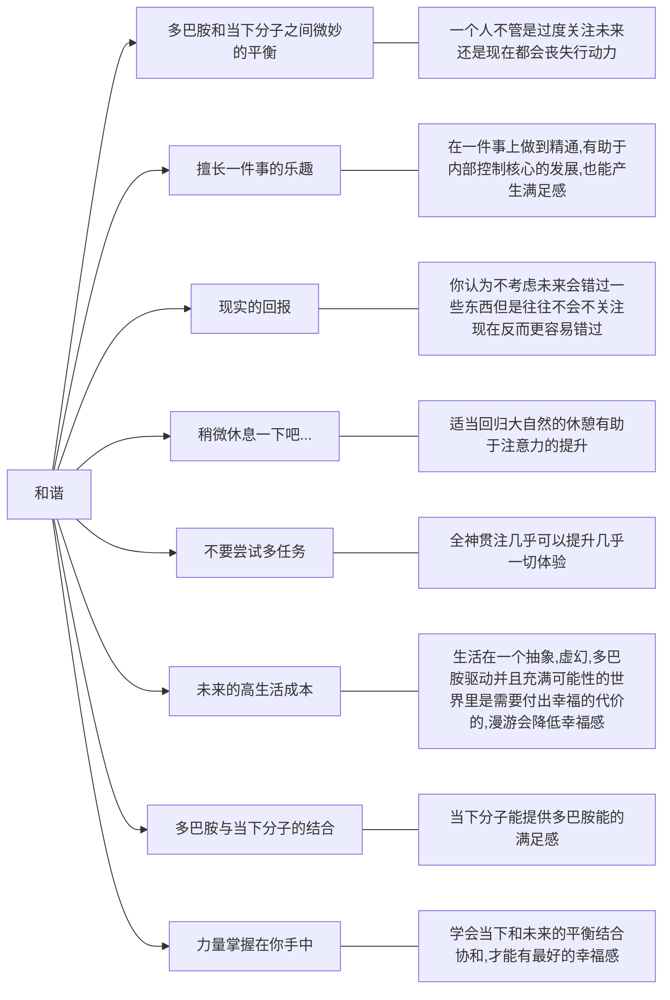

```mermaid
graph LR;
  A7[和谐]-->A71[多巴胺和当下分子之间微妙的平衡]---一个人不管是过度关注未来还是现在都会丧失行动力
  A7-->A72[擅长一件事的乐趣]---在一件事上做到精通,有助于内部控制核心的发展,也能产生满足感
  A7-->A73[现实的回报]---你认为不考虑未来会错过一些东西但是往往不会不关注现在反而更容易错过
  A7-->A74["稍微休息一下吧..."]---适当回归大自然的休憩有助于注意力的提升
  A7-->A75[不要尝试多任务]---全神贯注几乎可以提升几乎一切体验
  A7-->A76[未来的高生活成本]---生活在一个抽象,虚幻,多巴胺驱动并且充满可能性的世界里是需要付出幸福的代价的,漫游会降低幸福感
  A7-->A77[多巴胺与当下分子的结合]---当下分子能提供多巴胺能的满足感
  A7-->A78[力量掌握在你手中]---学会当下和未来的平衡结合协和,才能有最好的幸福感
```