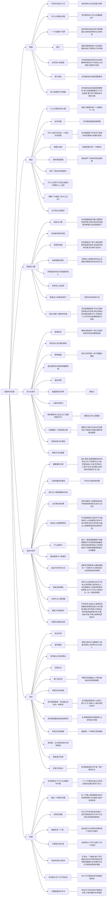

```mermaid
graph LR;
  A[贪婪的多巴胺]-->A1["爱情"]
  A-->A2[毒品]
  A-->A3[掌控的力量]
  A-->A4[天才与疯子]
  A-->A5[自由与保守]
  A-->A6[进步]
  A-->A7[和谐]
  A1-->A11[不快乐的快乐分子]---他的影响力比快乐要大得多
  A1-->A12[为什么爱情会消逝]---多巴胺完成工作之后通路结束了
  A1-->A13[一个大脑两个世界]---近体的和远体的世界-爱情需要从远体经验转变为近体经验
  A1-->A14[魅力]---看到的事物刺激了多巴胺的想象,淹没了精准当下的判断
  A1-->A15[找寻持久的爱情]---可持续的爱会将你对未来的期待转移到当下的体验,从幻想变为拥抱不完美
  A1-->A16[我不满足]---多巴胺的指令就是想要更多
  A1-->A17[持久爱情的化学钥匙]---多巴胺的座右铭就是想要更多,持久的爱情需要当下分子血清素,催产素,内啡肽和内源性大麻
  A2-->A21[什么在掌控你的大脑]---做自己想做的每个人想做的不一样
  A2-->A22[如何活着]---多巴胺控制着欲望回路
  A2-->A23[为什么我们生活在一个虚幻的世界里]---多巴胺理想下的未来不是真实的是理想化的最好选择
  A2-->A24[想要与喜欢]---欲望回路只是一个销售员
  A2-->A25[劫持欲望回路]---毒品破坏了原来的饱足感回路
  A2-->A26[闻不了漂白剂的瘾君子]
  A2-->A27[为什么快克可卡因比普通可卡因更让人上瘾?]
  A2-->A28[喝醉了与喝高了有什么区别?]
  A2-->A29[永不停止的渴望?]
  A3-->A31[规划与计算]---多巴胺鼓励我们最大程度地利用资源,在我们成功完成规划的事情之后会奖励我们
  A3-->A32[多巴胺带来的韧性]
  A3-->A33[坚韧的老鼠]---多巴胺驱动了努力,收到其他很多因素的影响,但如果没有多巴胺,努力都不会存在
  A3-->A34[自我效能的提升]---充满信心地期待成功会让你眼前的障碍消失但过犹不及
  A3-->A35[药物的副作用:乐观减肥和死亡]
  A3-->A36[体育场上的逆转]
  A3-->A37[假装待人和善有用吗?]---代理关系和亲和关系
  A3-->A38[顺从的猴子,谦卑的间谍]---多巴胺想要更多不在乎控制还是顺从的手段,相比较顺从的礼貌的控制行为,可能源于个人的不安全感或教育的不完善
  A4-->A41[脱离现实]---精神分裂症是一种以幻觉和妄想为特征的精神疾病
  A4-->A42[突出性与多巴胺的联系]
  A4-->A43[精神短路]---我们必须忽略一些不重要的事情
  A4-->A44[通过阻断多巴胺来质量精神病]
  A4-->A45[潜在抑制]
  A4-->A46[超越感官的世界]---想象力
  A4-->A47[心理时间旅行]
  A4-->A48["我的模型怎么会这么烂,我能修理它吗?"]---调整自己的认知模型
  A4-->A49["打破模型：开启创新之路"]---模型可以解决大部分的场景但也不能固化思维必要时候跳出模型
  A4-->A410[发现创造力的源泉]
  A4-->A411[释放艺术的能量]
  A5-->A51[被撤稿的文章]---善于操控,思想强硬和追求实用主义的,不是保守主义者,而是自由主义者.而利他主义,善于社交,有同理心和传统的则是保守主义者
  A5-->A52[人格测量的局限性]---平均分不能说明问题
  A5-->A53[进步主义者憧憬美好未来]
  A5-->A54[从好莱坞到哈佛]---高多巴胺的人能控制周边的环境但很难驾驭复杂的人际关系
  A5-->A55[自由主义者更聪明吗]---平均智商更高,但是平均不能说明什么总体都是正常水平,当环境发生变化的时候,自由主义者能更快的适应新的环境
  A5-->A56[什么是智力]---智力一般是衡量根据不完整数据进行归纳和使用抽象规则找出新信息的能力,但其他类似于决策和感情控制能力也很重要
  A5-->A57[群体趋势与个案差异]
  A5-->A58[自由于保守的对决]---控制多巴胺受体D4编码基因的一个变种为7R,拥有他的人喜欢探求新的事物
  A5-->A59[纳税还是捐款]---保守主义者有强大的当下系统,比如同理心和利他主义,多巴胺能的人希望得到更多的帮助,当下分子的人希望可以一对一的提供帮助
  A5-->A510[与保守主义者结婚]
  A5-->A511[嬉皮士和福音派]---平均而言,自由主义者更具有前瞻性思维和创造力,他们理智,聪明,但不转移,不易知足.保守者更加情绪平和,可靠,沉稳,传统,不那么聪明但更加快乐
  A5-->A512[可靠的非理性选民]
  A6-->A61[走出非洲]
  A6-->A62[冒险基因]---拥有长型DRD4基因的人更喜欢冒险,全世界大约1/5的人
  A6-->A63[多巴胺让你走的更远]
  A6-->A64[优胜劣汰]
  A6-->A65[哪个是对的]---种群迁移得越远,7R等位基因出现的频率越高
  A6-->A66[早期与现代移民]
  A6-->A67["双向情感障碍：多巴胺过多的另一种表现"]---多巴胺能激发智力,创造力,努力工作,也能让人做出怪异的动作
  A6-->A68[双向情感基因会推动移民吗]---会.美国移民多而病例高,日本移民少而低
  A6-->A69[性情亢进的国家]---美国是一个性情亢进的国家
  A6-->A610["发明家，企业家和诺巴尔奖获得者"]
  A6-->A611[我就是多巴胺]
  A6-->A612[无意识的挠头]---多巴胺是指挥,而不是一整个管弦乐队
  A7-->A71[多巴胺和当下分子之间微妙的平衡]---一个人不管是过度关注未来还是现在都会丧失行动力
  A7-->A72[擅长一件事的乐趣]---在一件事上做到精通,有助于内部控制核心的发展,也能产生满足感
  A7-->A73[现实的回报]---你认为不考虑未来会错过一些东西但是往往不会不关注现在反而更容易错过
  A7-->A74["稍微休息一下吧..."]---适当回归大自然的休憩有助于注意力的提升
  A7-->A75[不要尝试多任务]---全神贯注几乎可以提升几乎一切体验
  A7-->A76[未来的高生活成本]---生活在一个抽象,虚幻,多巴胺驱动并且充满可能性的世界里是需要付出幸福的代价的,漫游会降低幸福感
  A7-->A77[多巴胺与当下分子的结合]---当下分子能提供多巴胺能的满足感
  A7-->A78[力量掌握在你手中]---学会当下和未来的平衡结合协和,才能有最好的幸福感
```